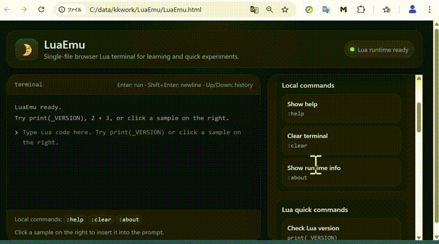

# LuaEmu

## Overview
LuaEmu is a single-file web terminal that runs Lua code in the browser with a beginner-friendly terminal UI.

## Quick Start
Open the demo page:
https://covao.github.io/LuaEmu/LuaEmu.html

## Features
- Single HTML file
- Runs Lua in the browser
- Terminal-style input and output in one scrollable screen
- Beginner-friendly command list and code samples
- Clickable examples that copy code into the terminal
- Command history with up and down keys
- Simple local commands such as `:help`, `:clear`, and `:about`
- Embedded favicon and lightweight GitHub Pages deployment

## Requirements
- Modern web browser
- Internet connection to load the Lua runtime library from CDN

## Installation
Copy `LuaEmu.html` to your local machine.

## Usage
Open `LuaEmu.html` in a browser, then type Lua code in the terminal area and press `Enter` to run it. Use `Shift + Enter` for multi-line code. The right pane shows beginner-friendly commands and sample programs. Click any sample to insert it into the terminal input. You can also use local commands such as `:help`, `:clear`, and `:about`.
